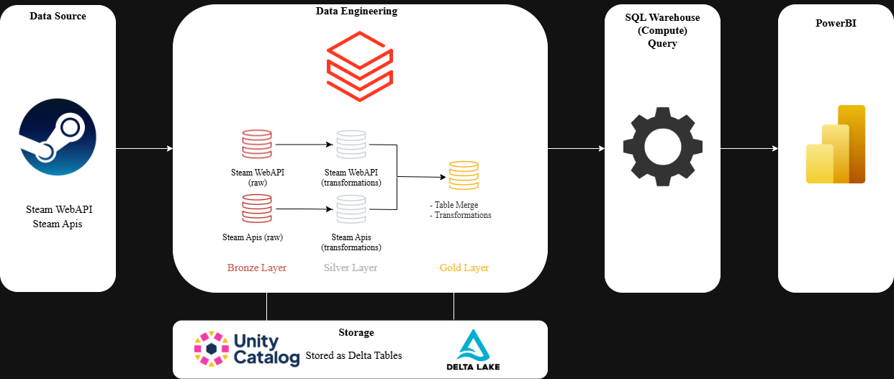
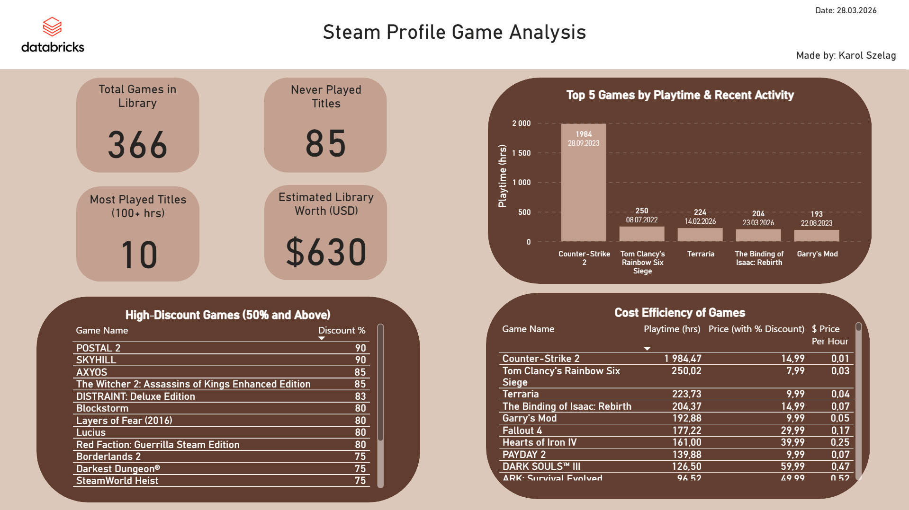

# 📘 Steam Analytics Pipeline — Databricks Lakehouse Project

## 🎮 Overview  
This project is an end‑to‑end data pipeline built on the **Databricks Lakehouse Platform**, designed to analyze a personal Steam game library using data from:

**Steam Web API** (owned games, playtime, last played date)  
**SteamApis** (game prices, discounts, currency data)

The goal of the project is to demonstrate a complete data workflow:

**API ingestion → JSON FILE -> BRONZE → SILVER → GOLD → SQL Warehouse → Power BI dashboard**

The final output is an interactive Power BI report showing insights such as:

- total library value  
- unplayed games  
- high‑playtime titles  
- price‑per‑hour efficiency  
- games with the highest discounts  
- recent activity and playtime distribution  

---

## 🧱 Architecture  
The project follows the **Lakehouse architecture** with Delta Lake as the storage layer and Unity Catalog as the governance layer.

```
External APIs → JSON Files -> Databricks Notebooks → BRONZE → SILVER → GOLD → SQL Warehouse → Power BI
```

### **Data Flow**
- **External APIs**  
  Steam Web API & SteamApis (JSON over HTTPS)
  
- **JSON Files**
  Uploaded to databricks catalog
  
- **Databricks Notebooks (PySpark/Python)**   
  - Spark DataFrames  
  - Writes to Delta Lake  

- **BRONZE Layer**  
  - Raw JSON  
  - Flattening    
  - Stored as **Delta Tables**
  - SQL Query - Creating Bronze Layer table

- **SILVER Layer**  
  - Schema cleanup  
  - Type normalization  
  - Price conversions  
  - Stored as **Delta Tables**
  - SQL Query - Creating Silver Layer table

- **GOLD Layer**  
  - Join games + prices  
  - Final curated table
  - Date Transformations
  - Stored as **Delta Tables**
  - SQL Query - Creating Gold Layer table

- **SQL Warehouse**  
  - Query engine for BI  
  - Exposes GOLD tables via JDBC/ODBC

- **Power BI**  
  - DirectQuery  
  - Final dashboard with KPIs, rankings, and insights  

---

## 🛠️ Tech Stack

### **Data Engineering**
- Databricks Notebooks (Python)
- PySpark / Spark SQL
- Delta Lake
- Unity Catalog
- Databricks SQL Warehouse

### **Data Sources**
- Steam Web API  
- SteamApis  

### **Visualization**
- Power BI (DirectQuery)

### **Storage**
- Delta Tables in Unity Catalog  
- DBFS Volumes  

---

## 📂 Project Structure

```
/notebooks
    analytics_steam_gold.ipynb
    clean_steam_prices_silver.ipynb
    clean_steam_silver.ipynb
    ingest_bronze_prices.ipynb
    ingest_steam_bronze.ipynb
    validation_steam.ipynb

/powerbi
    databricks_steam_analysis.pbix
    steam_databricks_dashboard.png
    databricks_steam_analysis.pdf

/docs
    databricks_pipeline_workflow.png

/README.md
```

---

## 🔄 Workflow



---

## 📊 Final Dashboard  



---

## 🚀 Key Features
- Fully automated multi‑layer pipeline  
- Delta Lake storage with ACID guarantees  
- Clean separation of BRONZE / SILVER / GOLD  
- Production‑style architecture  
- Interactive BI dashboard  

---

## 👤 Author  
**Karol Szeląg**  
Data Engineering & Analytics 

---
